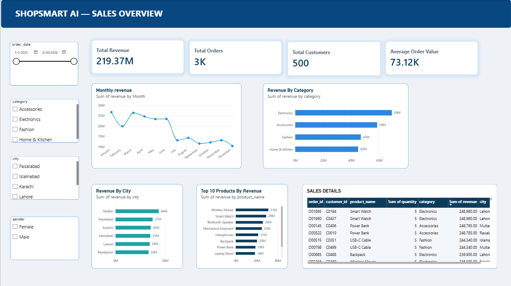
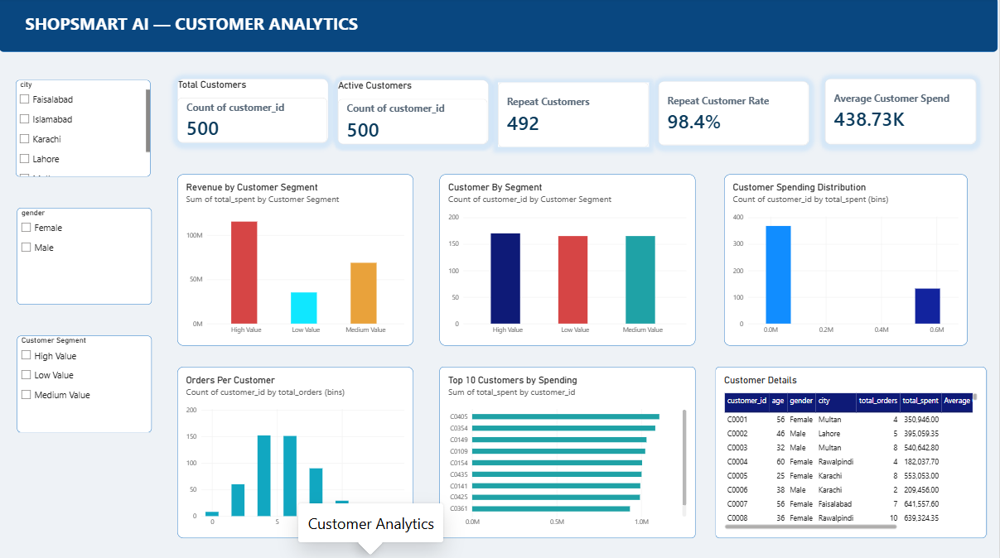
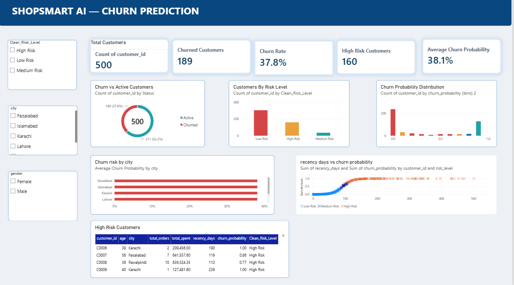

#  ShopSmart AI — E-Commerce Analytics & Churn Prediction

ShopSmart AI is an end-to-end e-commerce data analytics platform designed to analyze business performance, track key sales metrics, and predict customer churn using machine learning.

---

##  Project Overview
This project combines **SQL data modeling**, **Power BI interactive dashboards**, and a **Python Machine Learning pipeline** to deliver actionable business insights for e-commerce platforms.

### Key Objectives:
- **Sales Analytics:** Identify top revenue-generating products, sales trends, and regional performance.
- **Customer Segmentation:** Analyze purchasing behavior and order frequencies.
- **Predictive Analytics:** Predict customer churn using Machine Learning algorithms (Scikit-Learn).

---

##  Tech Stack & Tools
- **Data Analysis & ML:** Python (Pandas, NumPy, Scikit-Learn)
- **Database:** SQLite / Relational SQL
- **Visualization:** Power BI Desktop
- **IDE & Version Control:** VS Code, Jupyter Notebooks, Git & GitHub

---

##  Power BI Dashboard Screenshots

### 1. Executive Sales Overview

### 2. Customer Churn Analysis

### 3. Regional Performance & Insights

---

##  How to Run Locally

1. **Clone the Repository:**
git clone https://github.com/arshma63/ShopSmart-AI-Ecommerce-Analytics.git
cd ShopSmart-AI-Ecommerce-Analytics
2. **Open Jupyter Notebook:**
jupyter notebook notebooks/ShopSmart_Analytics.ipynb
3. **Power BI Dashboard:**
Open the `.pbix` file inside the `dashboard/` directory using **Power BI Desktop**.